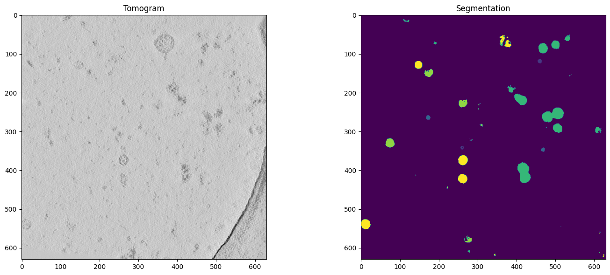

# Find Proteins in cryoET with CNN

This repo contains the object detection tools for finding specific proteins from cryo-electron tomography (cryoET) datasets.

Cryo-electron tomography (cryoET) generates 3D images of biological samples at a range of resolutions, from whole cells to molecules at near atomic resolution. 

CryoET data analysis can be difficult and time consuming. Therefore, the development of software and machine learning (ML) methods that can speed up data processing is essential to propel advances in the cryoET field. The schematic below highlights the time it takes to process images to obtain molecular structures.

CryoET image processing workflow showing the time it takes to get through each step.

This portfolio focus using deep learning to automate the object detection and annotation step, including codes to accomplish: 
* Model training 
* Inference
* Evaluation

*One example from the inference results:*

(code is under revision, please feel free to contact me regarding interests)
